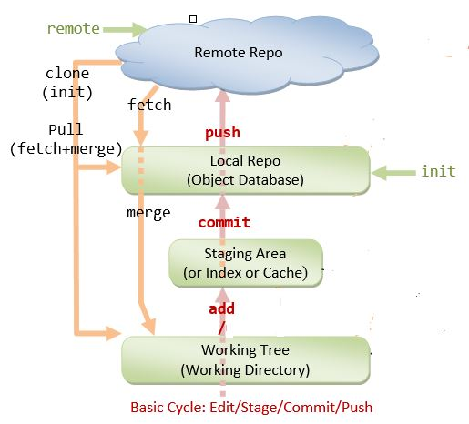

# 本地项目Git版本控制并同步到远程Github仓库的简单方法

初始环境：一个没有使用版本控制的本地目录。

<!-- TOC -->

- [本地项目Git版本控制并同步到远程Github仓库的简单方法](#本地项目git版本控制并同步到远程github仓库的简单方法)
  - [1 本地Git和远程Github版本控制的初始化](#1-本地git和远程github版本控制的初始化)
    - [1.1 本地安装Git、远程建立Github账户](#11-本地安装git远程建立github账户)
    - [1.2 配置Git本地用户名和email(和Github账户一致）](#12-配置git本地用户名和email和github账户一致)
  - [2  使用Git对本地项目进行版本控制](#2-使用git对本地项目进行版本控制)
    - [2.1  初始化本地项目的Git版本控制](#21-初始化本地项目的git版本控制)
    - [2.2 提交工作内容到Git仓库](#22-提交工作内容到git仓库)
      - [2.2.1 工作内容提交到`缓存区`](#221-工作内容提交到缓存区)
      - [2.2.2 存入`缓存区`的内容提交至本地仓库](#222-存入缓存区的内容提交至本地仓库)
  - [3 本地仓库的远程Github仓库初始化](#3-本地仓库的远程github仓库初始化)
    - [3.1 在Github账户中建立一个和本地项目目录`同名`的空仓库](#31-在github账户中建立一个和本地项目目录同名的空仓库)
    - [3.2 将远程Github仓库加为本Git项目的远程源](#32-将远程github仓库加为本git项目的远程源)
    - [3.3 `首次` 推送本地仓库到远程github仓库](#33-首次-推送本地仓库到远程github仓库)
  - [4 本地仓库工作内容变化更新、同步到远程github](#4-本地仓库工作内容变化更新同步到远程github)
    - [4.1 本地工作内容变化提交到暂存区](#41-本地工作内容变化提交到暂存区)
    - [4.2 存入暂存区内容提交至本地仓库](#42-存入暂存区内容提交至本地仓库)
    - [4.3 查询文件提交历史和恢复老版本(如需要)](#43-查询文件提交历史和恢复老版本如需要)
    - [4.4 本地仓库的更新同步到远程github仓库](#44-本地仓库的更新同步到远程github仓库)
    - [4.5 Git本地和远程仓库操作过程图](#45-git本地和远程仓库操作过程图)
  - [5 持久化远程Github账号](#5-持久化远程github账号)
  - [6 创建分支](#6-创建分支)
    - [6.1 本地新建分支](#61-本地新建分支)
    - [6.2 切换到新分支](#62-切换到新分支)
    - [6.3 新分支发布到远程Github上](#63-新分支发布到远程github上)
  - [7 删除分支](#7-删除分支)
    - [7.1 删除本地分支](#71-删除本地分支)
    - [7.2 删除远程Github仓库中的分支](#72-删除远程github仓库中的分支)
  - [8. 改变Git托管网站](#8-改变git托管网站)
    - [8.1. 在新托管网站建立一个和本地项目目录`同名`的空仓库](#81-在新托管网站建立一个和本地项目目录同名的空仓库)
    - [8.2. 同步本地仓库到新托管网站的远程仓库](#82-同步本地仓库到新托管网站的远程仓库)
  - [9 同一本地仓库使用多个远程仓库](#9-同一本地仓库使用多个远程仓库)
    - [9.1 添加一个远程仓库](#91-添加一个远程仓库)
    - [9.2 推送本地仓库内容到镜像仓库](#92-推送本地仓库内容到镜像仓库)
  - [10 Windows中使用Git GUI](#10-windows中使用git-gui)
  - [参考：](#参考)

<!-- /TOC -->

**NOTE**: 所有Git命令都须在用Git进行版本控制项目的目录下，打开的终端中执行

* open the terminal from the project directory, then run the git command.

## 1 本地Git和远程Github版本控制的初始化

对项目工作目录进行本地Git和远程Github版本控制需要做的初始化工作，只需做一次。

### 1.1 本地安装Git、远程建立Github账户

### 1.2 配置Git本地用户名和email(和Github账户一致）

Every git user should first introduce himself(yourname,youremail) to git, by running these two commands:

```bash
>git config --global user.name  yourname
>git config --global user.email youremail
```

## 2  使用Git对本地项目进行版本控制

### 2.1  初始化本地项目的Git版本控制

```bash
>git init
```

### 2.2 提交工作内容到Git仓库

#### 2.2.1 工作内容提交到`缓存区`

```bash
>git add .
```

注意： add命令后面是：`空格` 加一个 `.`

#### 2.2.2 存入`缓存区`的内容提交至本地仓库

```bash
>git commit -m “your desc of the commit"
```

## 3 本地仓库的远程Github仓库初始化

### 3.1 在Github账户中建立一个和本地项目目录`同名`的空仓库

新建的Github仓库必须是 **空** 仓库，不能有README.md等任何内容

### 3.2 将远程Github仓库加为本Git项目的远程源

在本地Git仓库所在目录下打开的终端中执行：

```bash
>git remote add origin https://github.com/your-username/your-reponame.git   
```

> origin: 用户在Github建立远程仓库时，git为用户默认创建的指向这个远程仓库的标签（名字）

### 3.3 `首次` 推送本地仓库到远程github仓库 

在本地Git仓库所在目录下打开的终端中执行：

```bash
>git push -u origin master
```

> master: git仓库中默认创建的第一个branch

## 4 本地仓库工作内容变化更新、同步到远程github

在初始化了本地仓库的远程Github仓库后，本地Git仓库中的本地也 远程内容更新和同步工作如下：

### 4.1 本地工作内容变化提交到暂存区

```bash
>git add .
```

### 4.2 存入暂存区内容提交至本地仓库

```bash
>git commit -m “your desc of the commit"
```

### 4.3 查询文件提交历史和恢复老版本(如需要)

查询`指定文件(filename)`的提交历史

```
》git log --patch filename
```

* type `q` to exit the log screen

回复`指定文件`到某次提交index `<unique ID of last commit>·`

```
git checkout <unique ID of last commit> filename
```

* Git lets us use just the first few characters `<unique ID of last commit>` (typically `seven` for normal size projects)

### 4.4 本地仓库的更新同步到远程github仓库

```bash
>git push
```

### 4.5 Git本地和远程仓库操作过程图 

   

## 5 持久化远程Github账号

本地全局存储持久化远程Github账号，解决每次链接到github远程仓库都必须输入用户名和密码登陆的问题

Windows下
```bash
>git config --global credential.helper wincred
```
Linux:
```
$git config --global credential.helper 'store --file ~/.mygit-credentials'
```

## 6 创建分支

设创建分支：devBranch1

### 6.1 本地新建分支 

```bash
>git branch devBranch1 
```

### 6.2 切换到新分支

```bash
>git checkout devBranch1
```

### 6.3 新分支发布到远程Github上

```bash
>git push origin devBranch1 
```

## 7 删除分支 

设删除分支：betaBranch1

### 7.1 删除本地分支 

```bash
>git branch -d betaBranch1 
```

### 7.2 删除远程Github仓库中的分支

```bash
git push origin –delete betaBranch1 
```
or 

```bash
>git push origin :betaBranch1
```

注意：分支名前的冒号 `:` 代表删除


注意：删除远程分支后，如果有对应的本地分支，本地分支并不会同步自动删除！如果需要删除本地分支，还需要执行本地删除。

## 8. 改变Git托管网站

### 8.1. 在新托管网站建立一个和本地项目目录`同名`的空仓库

如使用码云(gitee.com)作为新托管网站，在其中建立和本地项目目录`同名`的 **空** 仓库，不要有README.md等任何内容

https://gitee.com/your-username/your-reponame

### 8.2. 同步本地仓库到新托管网站的远程仓库

删除本地仓库的原远程仓库
```bash
git remote rm origin
```

将新托管网站的仓库加为本地Git仓库远程

如
```
git remote add origin https://gitee.com/your-username/your-reponame.git
```

首次提交本地网站到远程

```bash
git push --set-upstream origin master
```

提交成功以后的操作和使用Github作为仓库托管网站一样。

## 9 同一本地仓库使用多个远程仓库

### 9.1 添加一个远程仓库

如使用码云(gitee.com)为本地·your-reponame·加一个远程仓库，在其中建立和本地项目目录`同名`的 **空** 仓库，不要有README.md等任何内容

使用命令，为本地仓库加这个远程仓库，并为其命名，比如称为`mirror`：

```
git remote add mirror https://gitee.com/your-username/your-reponame.git
```

命令会修改config文件，加入一个`mirror`远程仓库：

```
[remote "origin"]
	url = https://github.com/your-username/your-reponame.git
	fetch = +refs/heads/*:refs/remotes/origin/*
[remote "mirror"]
	url = https://gitee.com/your-username/your-reponame.git
	fetch = +refs/heads/*:refs/remotes/mirror/*
[branch "master"]
	remote = origin
	merge = refs/heads/S2018
```

### 9.2 推送本地仓库内容到镜像仓库

使用以下命令，可以推送(`push`)本地内容到远程镜像仓库的master分支：

```
git push mirror master
```

## 10 Windows中使用Git GUI

在使用git的项目目录中打开终端，执行

```bash
>git gui
```

## 参考：

* [1] [Version Control with Git](https://swcarpentry.github.io/git-novice/)

* [2] [How to get started with GIT and work with GIT Remote Repo](http://www3.ntu.edu.sg/home/ehchua/programming/howto/Git_HowTo.html)

* [3] [Git Version Control in VS Code](https://code.visualstudio.com/docs/editor/versioncontrol)

